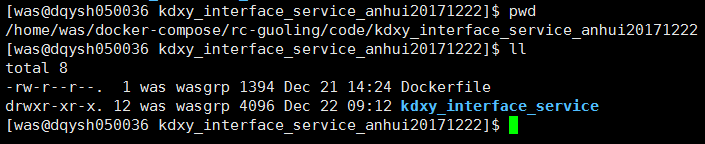

# 1.4. 订单状态通知(consumer)

## 一. 部署 RC 的宽带3.3 接口(利用swarm集群部署)
- 在172.16.50.36打镜像.
    - 1.打基础镜像 (因为是新下来的机器，所以第一次要准备一个基础镜像，供后面的其它镜像去引用).
        - 具体步骤入下:
            - 连接36服务器
            - cd /home/was/docker-compose/rc-guoling/base-image
            - 
            - docker build -t base_image:v20171223 .
    -  2.给宽带协议接口打基础镜像.
        -  具体步骤入下:
            -  cd /home/was/docker-compose/rc-guoling/code/kdxy_interface_service_anhui20171222
            -  
            - docker build -t rc-image-guoling-kdxy_interface_service:v201712223 .
    -  3.创建并运行容器(接口需要指定端口,左边是宿主机中规定的端口,右边是容器对外暴露的端口)
        -  docker run -i -t -p 6006:6006 --name kdxy_interface  rc-image-guoling-kdxy_interface_service:v201712223 /bin/bash
        -  如果创建命令无误,就会默认的进入容器的,容器只有启动了才能进入, 当然进入容器的命令是: docker exec -it kdxy_interface /bin/bash
        -  执行主文件: python RsaMain.py
        -  查看日志的目录: 
            - 1.先确保在容器里面
            - 2.cd /opt/logs/python-apps-logs/kdxy_interface_service/6006  下面去查看.
            -  
- 在10.128.2.96上跑服务


## 二. 部署 PROD 的宽带3.4 JOB(利用swarm集群部署)
- 在10.251.26.11(prod镜像库)上打镜像.
- 在10.128.2.96上跑服务

### 主题： 宽带协议3.4 Consumer 在集群服务器上部署两个节点

### 集群服务器:
- 10.128.2.96（主机）
- 10.128.2.98（从机）
- 10.128.2.99（从机）

### 具体步骤入下:
1.  连接vpn和IT资源池，通过运维客户端，登录到10.128.2.96的服务器上
2.  cd /home/was/docker_compose/prod-guoling/kdxy-interface/kdxy-3.4  目录
3.  vi docker-compose.yml文件
4.  docker-compose.yml文件内容入下:
```docker
    version: '3'
    services:
        prod-guoling-kdxy-service-34:
        image: 10.251.26.11:5000/prod-image-kdxy-order-status-notice-consumer:20171222_01
        restart: always
        deploy:
            replicas: 2
            restart_policy:
                condition: on-failure
        networks:
            - service-net
        container_name: prod-guoling-kdxy-20171222
        volumes:
            - /app/logs1/prod-guoling/python-server/kdxy-consumer:/opt/logs/python-apps-logs/orderstatusnotice
        environment:
            - LOG_PREFIX=/opt/logs
    networks:
        service-net:
```
5.  去10.251.26.11(prod镜像库)上打镜像

    5.1 cd /home/was/docker_compose/prod-guoling/prod-tyxb-python-job/order_status_notice 目录
    
    5.2 在这个目录下面 把你的项目order-status-notice拷贝过来，同时编写Dockerfile文件

    5.3 Dockerfile文件 文件内容如下：
    ```docker
    # Dockerfile for rc-image
    # 2017-08-23
    # Dockerfile 创建人:guoling
    # 安装所有依赖的python包
    #
    #  VERSION 0.0.1
    #  导入基础包创建基础镜像
    FROM prod-image-tyxb/python/web:v1

    #  设置该镜像的作者
    MAINTAINER guoling

    #  设置环境变量
    ENV LANG en_US.UTF-8
    ENV TZ=Asia/Shanghai
    RUN ln -snf /usr/share/zoneinfo/$TZ /etc/localtime && echo $TZ > /etc/timezone

    #  复制文件指令
    COPY ./order-status-notice/  /app/python_apps/order_status_notice/order-status-notice/

    # 指定容器运行时监听的端口号
    # EXPOSE 19002

    #  指定 'RUN' 'CMD' 'ENTRYPOINT'
    WORKDIR /app/python_apps/order_status_notice/order-status-notice/

    #  提供容器默认执行命令
    CMD ["python","OrderStatusNoticeMain.py"] 
    ```
6.  在这个目录下面打镜像
    docker build -t prod-image-kdxy-order-status-notice-consumer:20171222_01 .
7.  标记镜像
    docker tag prod-image-kdxy-order-status-notice-consumer:20171222_01 localhost:5000/prod-image-kdxy-order-status-notice-consumer:20171222_01
8.  把被标记的镜像推到仓库
    docker push localhost:5000/prod-image-kdxy-order-status-notice-consumer:20171222_01
9.  去10.128.2.96服务器将仓库中的镜像pull下来 
    docker push localhost:5000/prod-image-kdxy-order-status-notice-consumer:20171222_01
10. 执行docker-cpmpose.yml文件,将conusmer跑起来.
    docker stack deploy -c docker-compose.yml kdxy    # kdxy 只是取一个别名
-   注意：
    - 运行了2个服务	因为docker-cpmpose.yml文件中指定的是两个节点,所以跑了两个consumer.
    - 没有设置暴露端口   因为consumer或者job不需要对外暴露端口.
    - 日志目录		这个目录是我事先建好的  /app/logs1/prod-guoling/python-server/kdxy-consumer
				大意:    在冒号【:】左边的是宿主机的目录，右边是容器的目录  