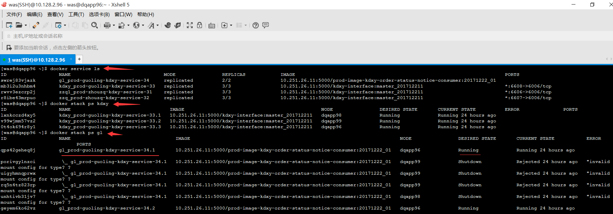

# 1.4. 订单状态通知(consumer)
## 一. 部署 PROD 的宽带3.4 JOB
- 在10.251.26.11(prod镜像库)上打镜像.
- 在10.128.2.96上跑服务

### 主题： 宽带协议3.4 Consumer 在集群服务器上部署两个节点（方式一）


### 集群服务器:
- 10.128.2.96（主机）
- 10.128.2.98（从机）
- 10.128.2.99（从机）

### 具体步骤入下:
1.  连接vpn和IT资源池，通过运维客户端，登录到10.128.2.96的服务器上
2.  去10.251.26.11(prod镜像库)上打镜像

    2.1 cd /home/was/docker_compose/prod-guoling/prod-tyxb-python-job/order_status_notice 目录
    
    2.2 在这个目录下面 把你的项目order-status-notice拷贝过来，同时编写Dockerfile文件

    2.3 Dockerfile文件 文件内容如下：
    ```docker
    # Dockerfile for rc-image
    # 2017-08-23
    # Dockerfile 创建人:guoling
    # 安装所有依赖的python包
    #
    #  VERSION 0.0.1
    #  导入基础包创建基础镜像
    FROM prod-image-tyxb/python/web:v1

    #  设置该镜像的作者
    MAINTAINER guoling

    #  设置环境变量
    ENV LANG en_US.UTF-8
    ENV TZ=Asia/Shanghai
    RUN ln -snf /usr/share/zoneinfo/$TZ /etc/localtime && echo $TZ > /etc/timezone

    #  复制文件指令
    COPY ./order-status-notice/  /app/python_apps/order_status_notice/order-status-notice/

    # 指定容器运行时监听的端口号
    # EXPOSE 19002

    #  指定 'RUN' 'CMD' 'ENTRYPOINT'
    WORKDIR /app/python_apps/order_status_notice/order-status-notice/

    #  提供容器默认执行命令
    CMD ["python","OrderStatusNoticeMain.py"] 
    ```
3.  在这个目录下面打镜像
    docker build -t prod-image-kdxy-order-status-notice-consumer:20171222_01 .
4.  标记镜像
    docker tag prod-image-kdxy-order-status-notice-consumer:20171222_01 localhost:5000/prod-image-kdxy-order-status-notice-consumer:20171222_01
5.  把被标记的镜像推到仓库
    docker push localhost:5000/prod-image-kdxy-order-status-notice-consumer:20171222_01
6.  去10.128.2.96服务器将仓库中的镜像pull下来 (如果用docker-compose.yml 起服务就不用走这一步)
    docker pull localhost:5000/prod-image-kdxy-order-status-notice-consumer:20171222_01
7.  cd /home/was/docker_compose/prod-guoling/kdxy-interface/kdxy-3.4  目录
8.  vi docker-compose.yml文件
9.  docker-compose.yml文件内容入下:
```docker
    version: '3'
    services:
        prod-guoling-kdxy-service-34:
        image: 10.251.26.11:5000/prod-image-kdxy-order-status-notice-consumer:20171222_01
        restart: always
        deploy:
            replicas: 2
            restart_policy:
                condition: on-failure
        networks:
            - service-net
        container_name: prod-guoling-kdxy-20171222
        volumes:
            - /app/logs1/prod-guoling/python-server/kdxy-consumer:/opt/logs/python-apps-logs/orderstatusnotice
        environment:
            - LOG_PREFIX=/opt/logs
    networks:
        service-net:
```

10. 执行docker-cpmpose.yml文件,将conusmer跑起来.
    docker stack deploy -c docker-compose.yml kdxy    # kdxy 只是取一个别名 
    注意：
    - 运行了2个服务	因为docker-cpmpose.yml文件中指定的是两个节点,所以跑了两个consumer.
    - 没有设置暴露端口   因为consumer或者job不需要对外暴露端口.
    - 日志目录		这个目录是我事先建好的  /app/logs1/prod-guoling/python-server/kdxy-consumer
				大意:    在冒号【:】左边的是宿主机的目录，右边是容器的目录  
11. 查看节点服务是否正常启动
    

12. 如果docker-compose.yml运行过了,下次就只需要更新这个服务即可.
-    docker service update --image 10.251.26.11:5000/kdxy-interface:master_20171227_gl kdxy_prod-guoling-kdxy-service-34