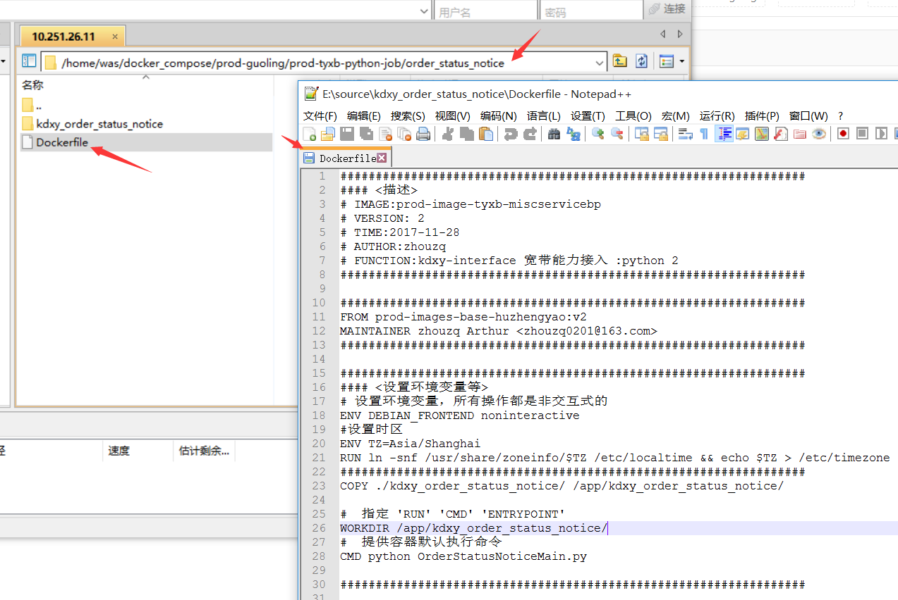
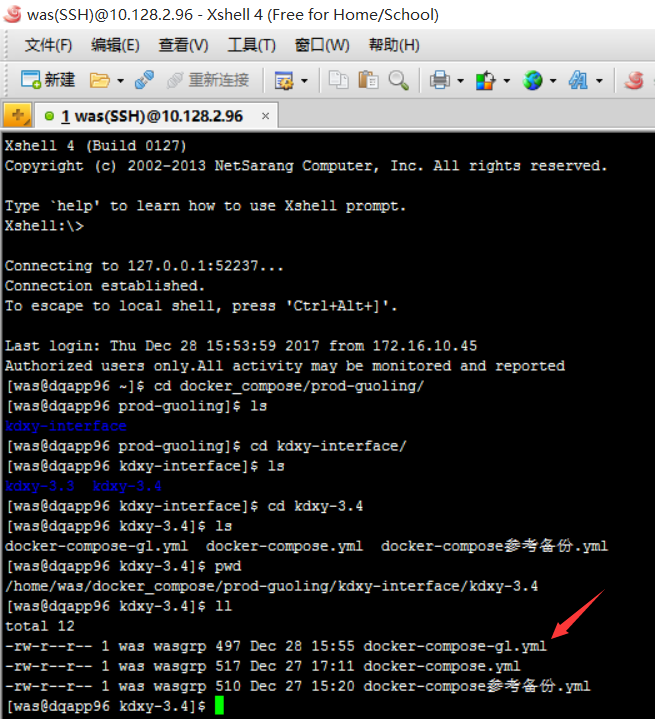
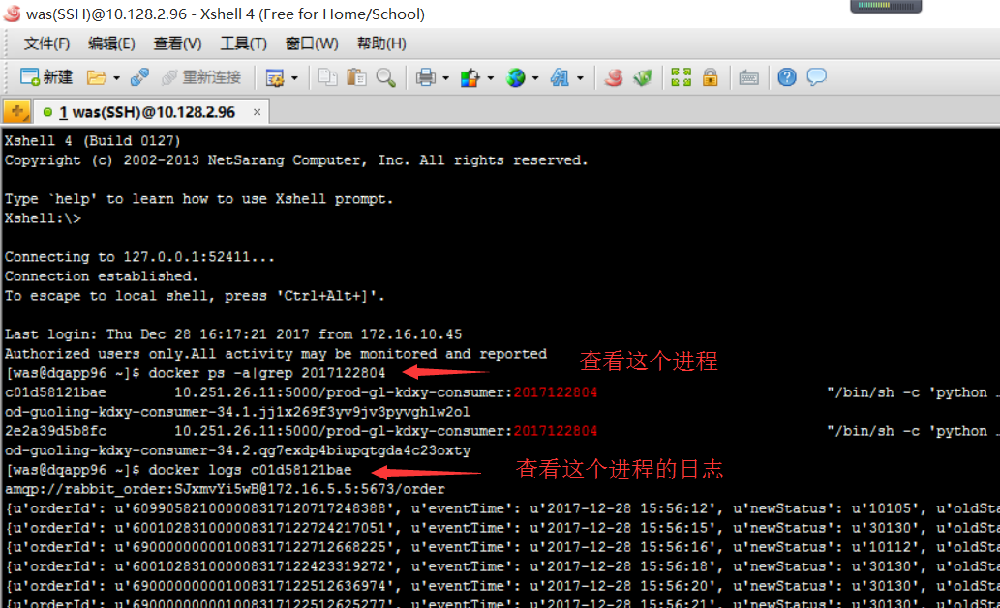

# 1.4. 订单状态通知(consumer)
## 一. 部署 PROD 的宽带3.4 JOB
- 在10.251.26.11(prod镜像库)上打镜像.
- 在10.128.2.96上跑服务

### 主题： 宽带协议3.4 Consumer 在集群服务器上部署两个节点（老方式【成功】）


### 集群服务器:
- 10.128.2.96（主机）
- 10.128.2.98（从机）
- 10.128.2.99（从机）

### 具体步骤入下:
1.  连接vpn和IT资源池，通过运维客户端，登录到10.128.2.96的服务器上
2.  写Dockfile文件
    到此目录下写Dockfile文件
    

    ```docker
    ##################################################################
    #### <描述>
    # IMAGE:prod-image-tyxb-miscservicebp
    # VERSION: 2
    # TIME:2017-11-28
    # AUTHOR:zhouzq
    # FUNCTION:kdxy-interface 宽带能力接入 :python 2
    ##################################################################

    ##################################################################
    FROM prod-images-base-huzhengyao:v2
    MAINTAINER zhouzq Arthur <zhouzq0201@163.com>
    ##################################################################

    ##################################################################
    #### <设置环境变量等>
    # 设置环境变量，所有操作都是非交互式的
    ENV DEBIAN_FRONTEND noninteractive
    #设置时区
    ENV TZ=Asia/Shanghai
    RUN ln -snf /usr/share/zoneinfo/$TZ /etc/localtime && echo $TZ > /etc/timezone
    ##################################################################
    COPY ./kdxy_order_status_notice/ /app/kdxy_order_status_notice/

    #  指定 'RUN' 'CMD' 'ENTRYPOINT'
    WORKDIR /app/kdxy_order_status_notice/
    #  提供容器默认执行命令
    CMD python OrderStatusNoticeMain.py

    ##################################################################
    ```
3. 将最新代码放到11服务器指定目录下
    cd /home/was/docker_compose/prod-guoling/prod-tyxb-python-job/order_status_notice
    
4. 打镜像
   docker build -t prod-gl-kdxy-consumer:2017122804 .

5. 标记镜像
   docker tag prod-gl-kdxy-consumer:2017122804 localhost:5000/prod-gl-kdxy-consumer:2017122804

6. push镜像
   docker push localhost:5000/prod-gl-kdxy-consumer:2017122804

7. 到96服务器上编写docker-compose.yml文件
   
   ```docker
    version: '3'
    services:
        prod-guoling-kdxy-consumer-34:
            image: 10.251.26.11:5000/prod-gl-kdxy-consumer:2017122804
            restart: always
            deploy:
            replicas: 2
            restart_policy:
                condition: on-failure
            networks:
            - service-net
            container_name: prod-gl-kdxy-consumer:2017122804
            volumes:
            - /app/logs1/prod-guoling/python-server/kdxy-consumer:/opt/logs/python-apps-logs/orderstatusnotice
            environment:
            - LOG_PREFIX=/opt/logs
    networks:
        service-net:
   ```
8. 执行docker-compose.yml文件

   cd  /home/was/docker_compose/prod-guoling/kdxy-interface/kdxy-3.4

   docker stack deploy -c docker-compose-gl.yml kdxy-consumer-gl2
7. 查看服务是否启动
   docker service ls
   
   docker service rm 服务ID   # 表示删除服务
8. 如果服务没有启动可以检测代码哪里出错
   docker ps -a|grep 粗略的镜像名
   docker logs 进程ID号
   