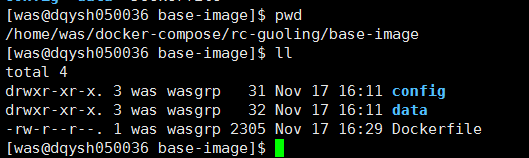
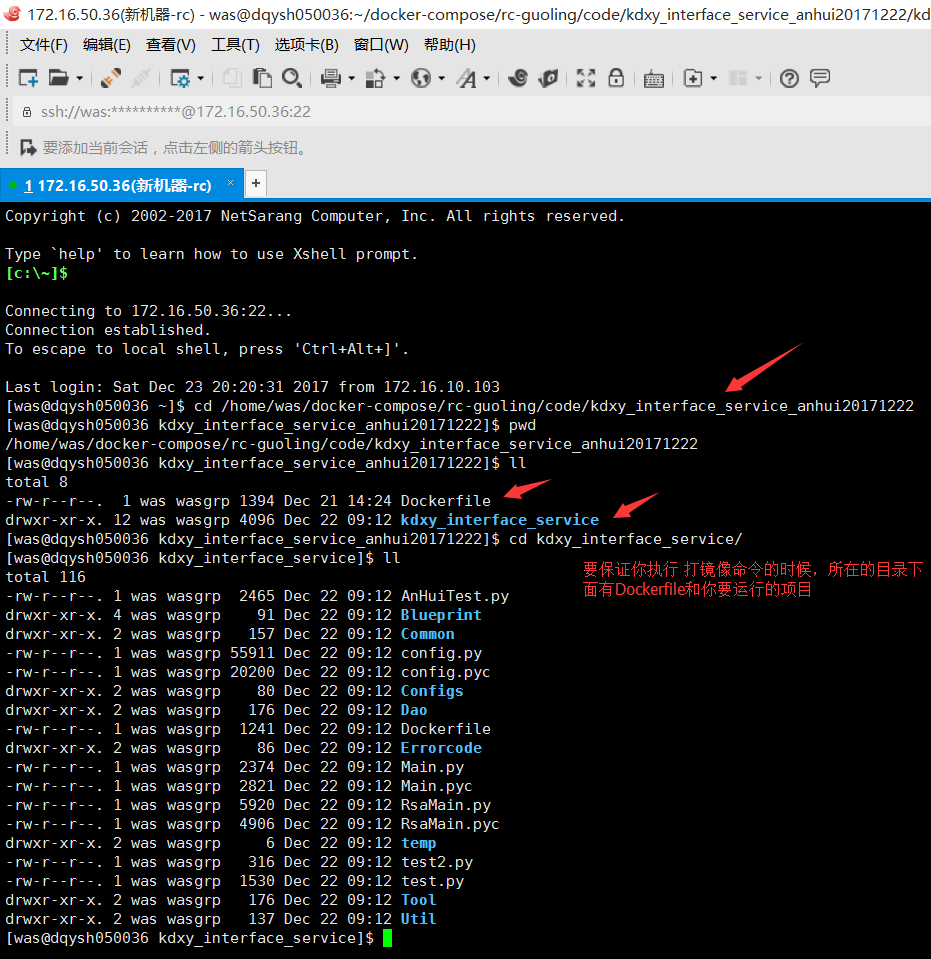
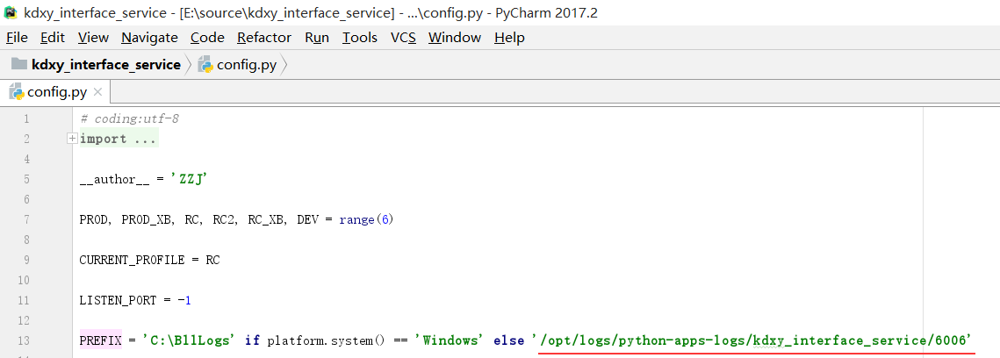

# 1.1. 宽带信息查询(接口)
## 一. 部署 RC 的宽带3.3 接口
- 在172.16.50.36打镜像.
    - 1.打基础镜像 (因为是新下来的机器，所以第一次要准备一个基础镜像，供后面的其它镜像去引用).
        - 具体步骤入下:
            - 连接36服务器
            - cd /home/was/docker-compose/rc-guoling/base-image
              
            - docker build -t base_image:v20171223 .
    -  2.给宽带协议接口打基础镜像.
        -  具体步骤入下:
            -  cd /home/was/docker-compose/rc-guoling/code/kdxy_interface_service_anhui20171222
               
            - docker build -t rc-image-guoling-kdxy_interface_service:v201712223 .
    -  3.创建并运行容器(接口需要指定端口,左边是宿主机中规定的端口,右边是容器对外暴露的端口)
        -  docker run -i -t -p 6006:6006 --name kdxy_interface  rc-image-guoling-kdxy_interface_service:v201712223 /bin/bash
        -  如果创建命令无误,就会默认的进入容器的,容器只有启动了才能进入, 当然进入容器的命令是: docker exec -it kdxy_interface /bin/bash
        -  执行主文件: python RsaMain.py
        -  查看日志的目录: 
            - 1.先确保在容器里面
            - 2.cd /opt/logs/python-apps-logs/kdxy_interface_service/6006  下面去查看.
              