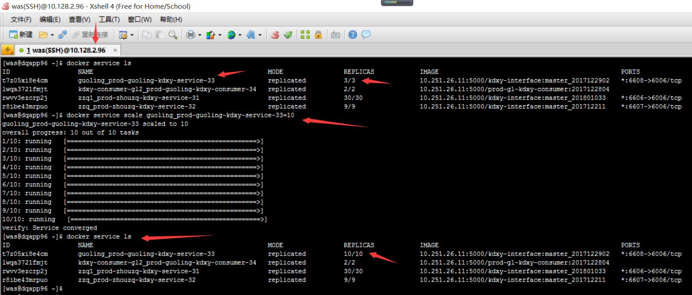

# 1.3. 订单查询(接口)
## 一. 部署 PROD 的宽带3.3 JOB(利用swarm集群部署)
- 在10.251.26.11(prod镜像库)上打镜像.
- 在10.128.2.96上跑服务
### 主题： 宽带协议3.3 Consumer 在集群服务器上部署3个节点

### 集群服务器:
- 10.128.2.96（主机）
- 10.128.2.98（从机）
- 10.128.2.99（从机）

### 具体步骤入下:
- 1.在10.128.2.96服务器上写docker-compose文件
- 2.vi docker-compose文件 具体内容如下:
  ```linux
  version: '3'
  services:
    prod-guoling-kdxy-service-33:
      image: 10.251.26.11:5000/kdxy-interface:master_201712211
      restart: always
      deploy:
        replicas: 3
        restart_policy:
          condition: on-failure
      ports:
        - "6608:6006"
      networks:
        - service-net
      container_name: prod-guoling-kdxy-201712211
      volumes:
        - /app/logs1/prod-zhouzq/python-server/kdxy-interface:/opt/logs/python-apps-logs/kdxy_interface_service/6006
      environment:
        - LOG_PREFIX=/opt/logs
  networks:
    service-net:
  ```
- 3.git  合并本地最新代码和git上的master分子的代码(因为master 默认的是放生产的代码)
  
- 4.cd /home/was/docker_compose/prod-guoling/kdxy_interface_service
    
- 5.写 vi Dockerfile文件
      ```docker
      # Dockerfile for prod-image-guoling-kdxy_interface_service:20171127_01
      # 2017-11-27 Dockerfile
      # Dockerfile 创建人:guoling

      #  导入基础包创建基础镜像
      FROM prod-image-tyxb/python/web:v1

      #  设置该镜像的作者
      MAINTAINER guoling Arthur <1973427872@qq.com>

      #  设置环境变量
      ENV LANG en_US.UTF-8
      ENV TZ=Asia/Shanghai
      RUN ln -snf /usr/share/zoneinfo/$TZ /etc/localtime && echo $TZ > /etc/timezone

      #RUN apt-get install -y vim curl

      RUN mkdir -p /app/code/kdxy_interface_service/

      # 拷贝项目到容器
      # COPY ../code/kdxy_interface_service/ /app/code/kdxy_interface_service/
      COPY ./code/kdxy_interface_service/ /app/code/

      EXPOSE 6006
      # 切换到当前工作目录
      WORKDIR /app/code/
      #  提供容器默认执行命令
      CMD ["python","RsaMain.py"]
      ```
-  6.在pycharm 上编辑.gitlab-ci.yml文件
       ```linux
        image: docker:latest

        before_script:
            - echo "start build kdxy-interface"

        after_script:
            - echo "end build kdxy-interface"

        stages:
            - build
            - test
            - deploy

        build_job:
            stage: build
            script:
             - docker build -t localhost:5000/kdxy-interface:master_201712211 .
            only:
             - master_201712211

            tags:
             - master_tyxb
             - prod

        test_job:
            stage: test
            script:
             - echo "test kdxy-interface"
            only:
             - master_201712211

            tags:
             - master_tyxb
             - prod

        deploy_job:
            stage: deploy
            script:
            - docker push localhost:5000/kdxy-interface:master_201712211
            only:
            - master_201712211

        tags:
            - master_tyxb
            - prod
       ```  
    - 确定  docker build -t localhost:5000/kdxy-interface:master_201712211 . 里面的master_201712211这个名字
    - 2.所有的 only 里面的 值要和  master_201712211一致
        
    - 3.添加tag标签
        
    - 4.写tag
        
    - 5.查看新创建好了的表签
        
    - 6.可以查看tag执行的变化状态
        
    - 7.在服务器上用命令查看结果
        

- 7. docker service scale guoling_prod-guoling-kdxy-service-33=10
- 

