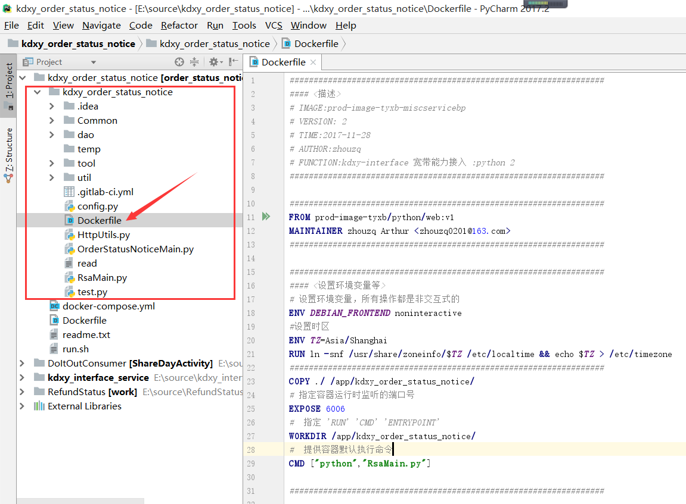
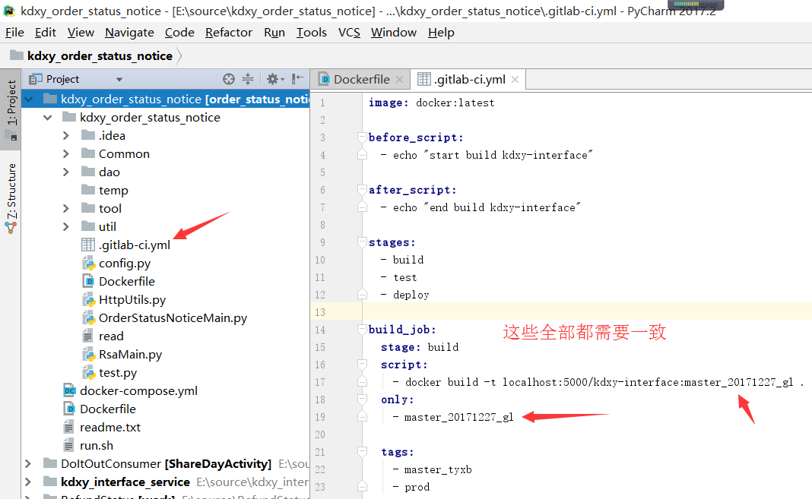
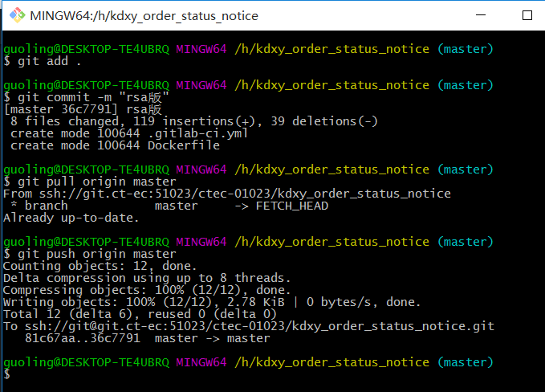
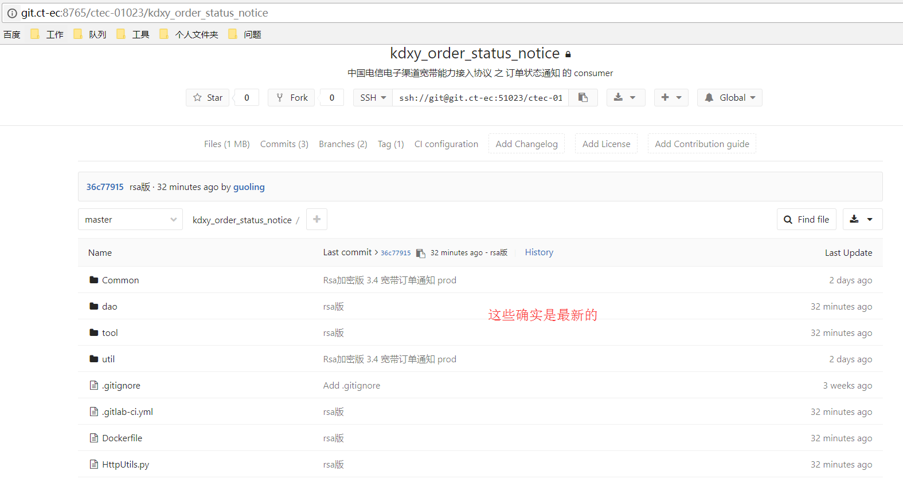
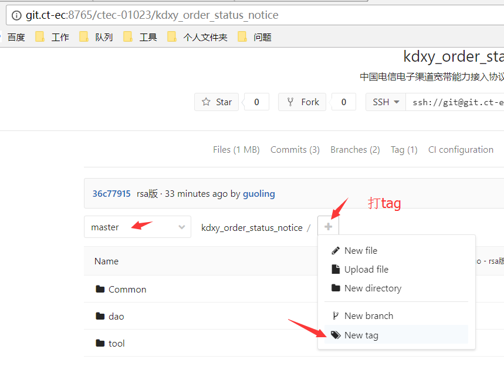
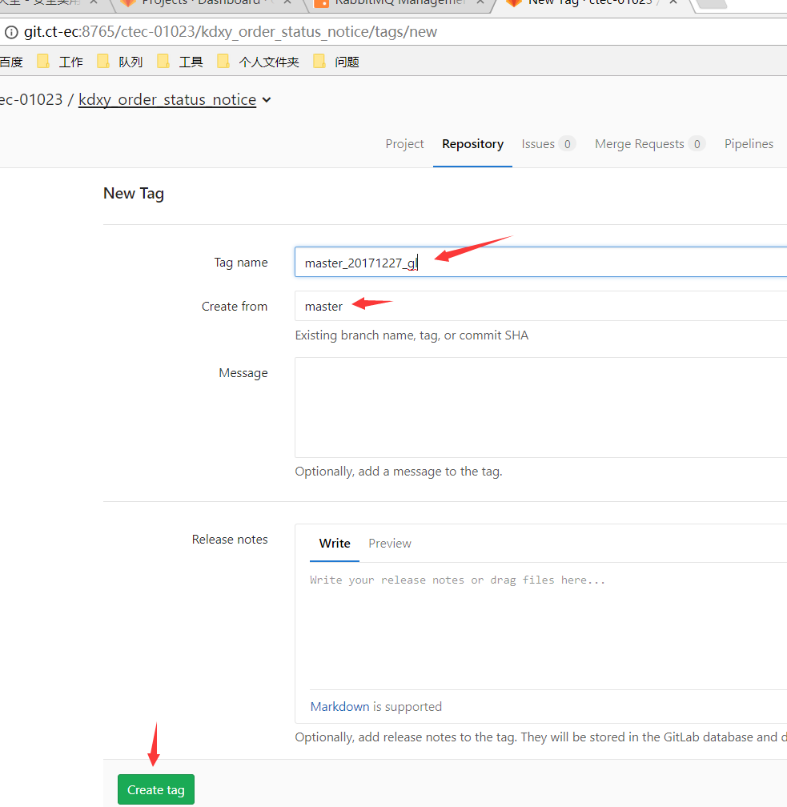
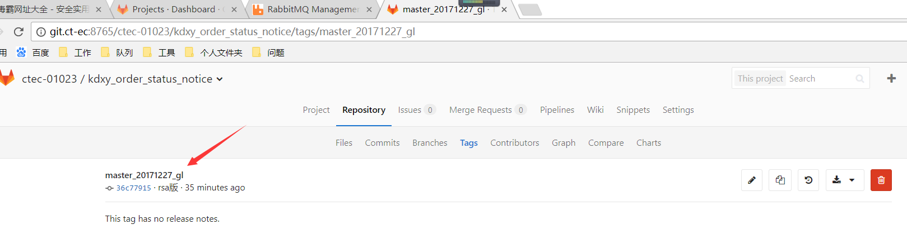
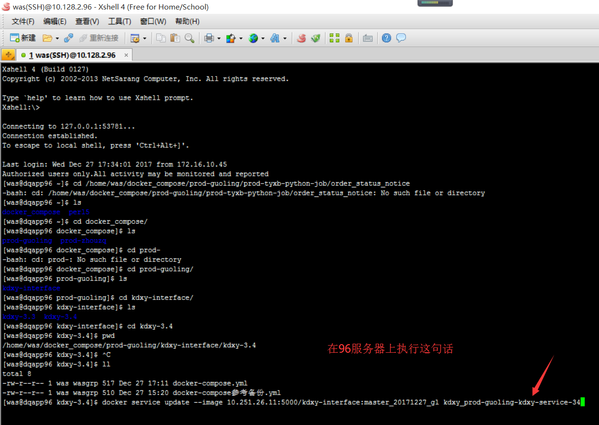

# 1.4. 订单状态通知(consumer)
## 一. 部署 PROD 的宽带3.4 JOB
- 在10.251.26.11(prod镜像库)上打镜像.
- 在10.128.2.96上跑服务

### 主题： 宽带协议3.4 Consumer 在集群服务器上部署两个节点（方式二）


### 集群服务器:
- 10.128.2.96（主机）
- 10.128.2.98（从机）
- 10.128.2.99（从机）

### 具体步骤入下:
1.  连接vpn和IT资源池，通过运维客户端，登录到10.128.2.96的服务器上
2.  在代码中写Dockfile文件
    
3.  在代码中写.gitlab-ci.yml文件
    
    ```docker
    image: docker:latest

    before_script:
    - echo "start build kdxy-interface"

    after_script:
    - echo "end build kdxy-interface"

    stages:
    - build
    - test
    - deploy

    build_job:
    stage: build
    script:
        - docker build -t localhost:5000/kdxy-interface:master_20171227_gl .
    only:
        - master_20171227_gl

    tags:
        - master_tyxb
        - prod

    test_job:
    stage: test
    script:
        - echo "test kdxy-interface"
    only:
        - master_20171227_gl

    tags:
        - master_tyxb
        - prod

    deploy_job:
    stage: deploy
    script:
        - docker push localhost:5000/kdxy-interface:master_20171227_gl
    only:
        - master_20171227_gl

    tags:
        - master_tyxb
        - prod

    ```
4. 将最新代码推到git服务器
   
5. 到git上去查看是否是最新代码
   
6. 添加tag(相当于打镜像)
   
   
   
   cd /home/was/docker_compose/prod-guoling/prod-tyxb-python-job/order_status_notice
   
7. 如果以后每次更新了代码,直接推送到gitlab的master上,然后打tag,tag里面的名字每次都需要唯一.然后执行update docker-compose...那句话即可.