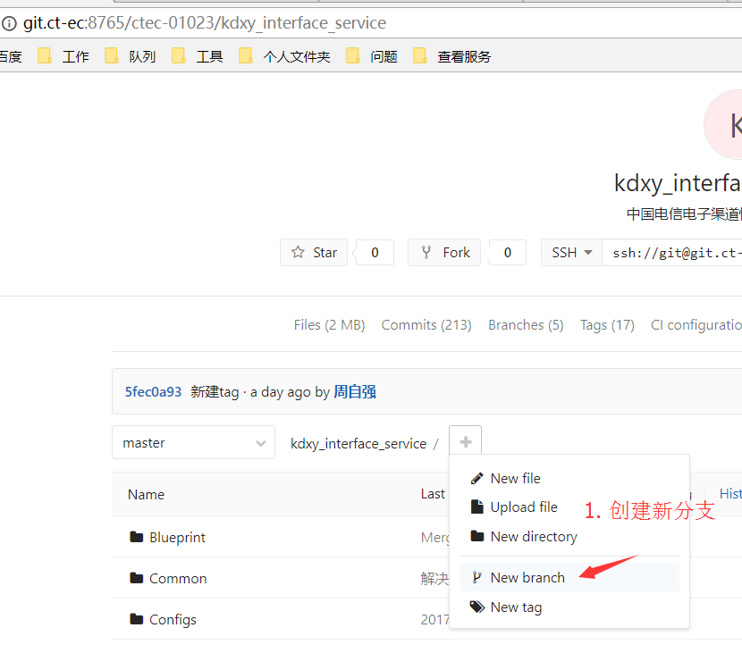
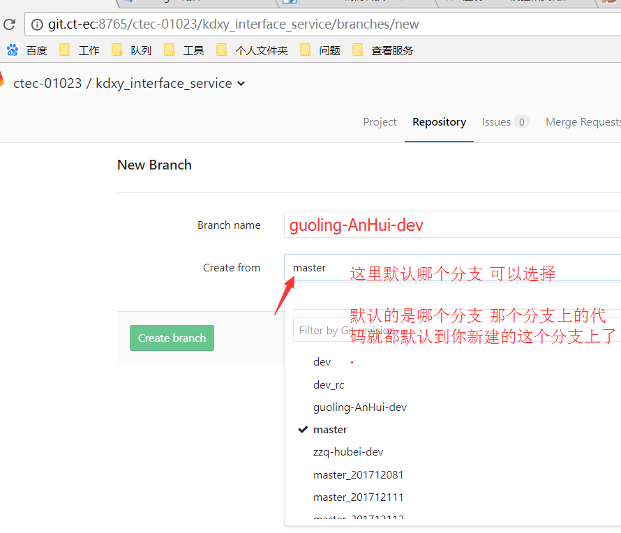
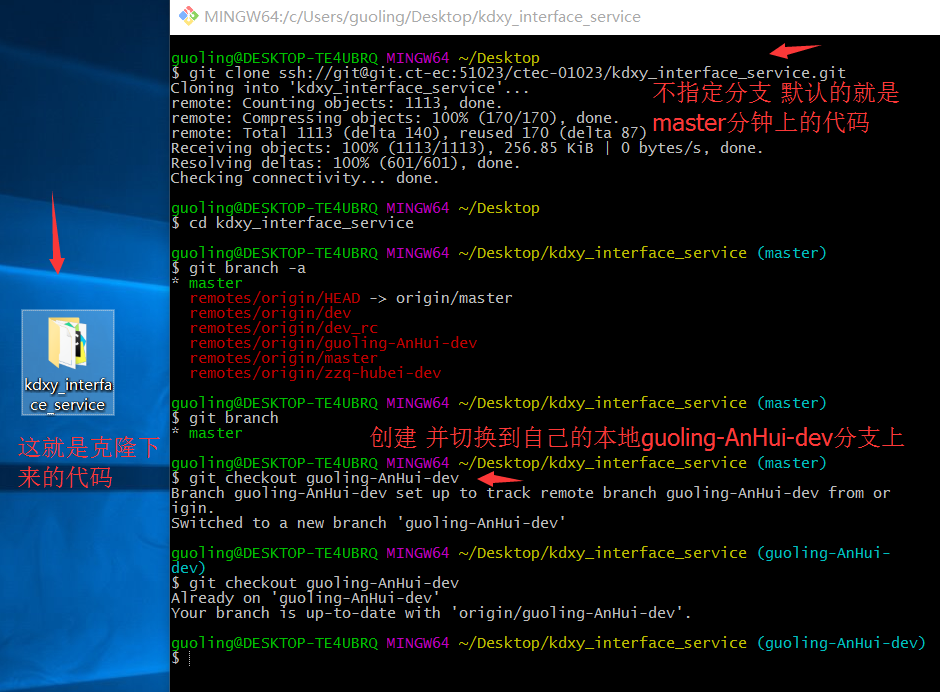
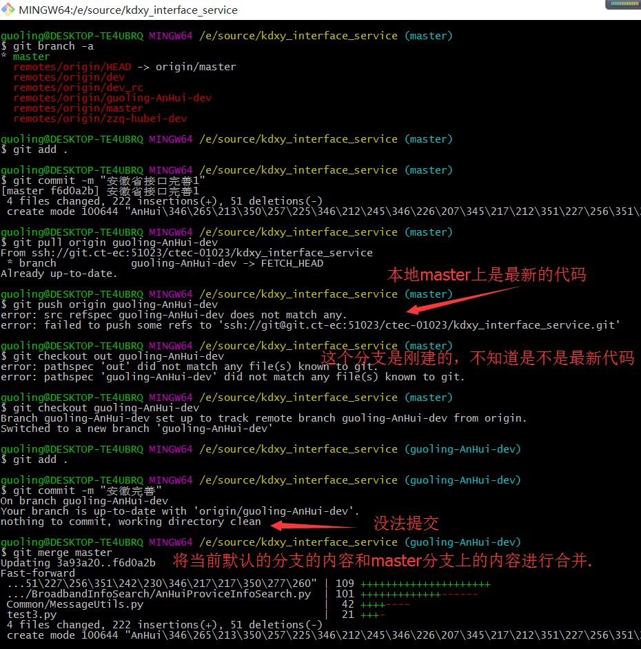
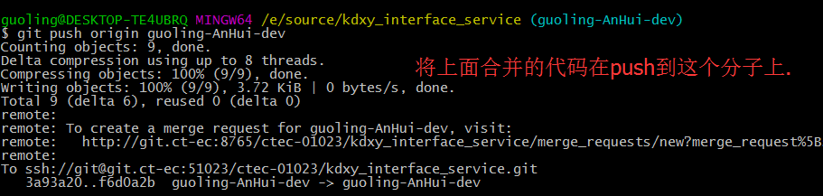
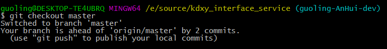
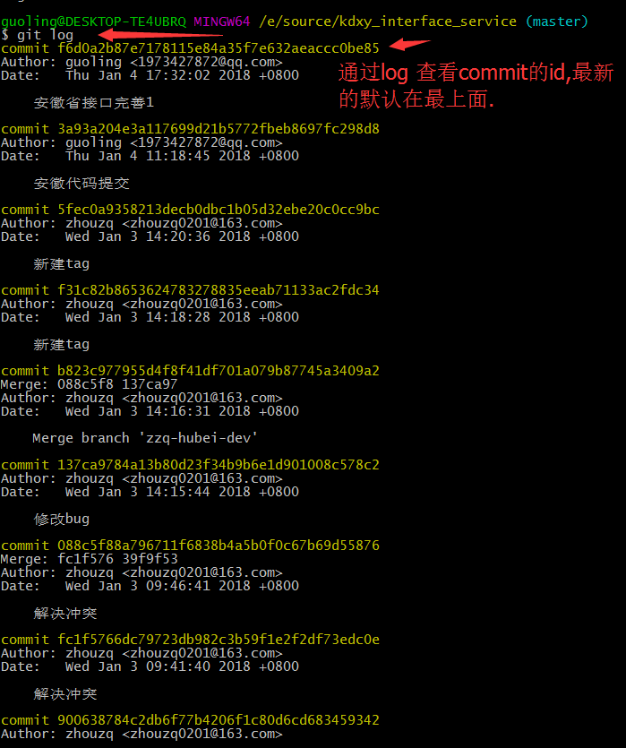
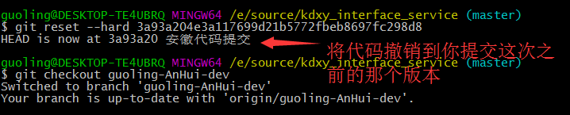
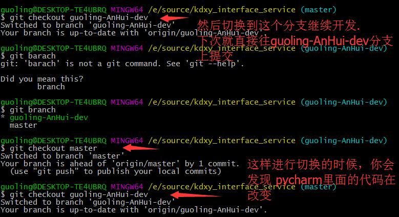

# git


## git常用命令:
- 初始化本地仓库
```
git init
```
- 查看服务器分支和本地分支，标记*的表示当前所在的分支
```
git branch -a
```
- 将工作区的代码提交到暂存区
```
git add .
```
- 将暂存区的代码提交到本地仓库区(提交后,暂存区的内容就清空了)
```
git commit -m "注释部分"
```
- 把远程dev分支上的内容拉下来
```
git pull origin dev
```
- 把当前分支上的内容推送到远程服务器的dev分支
```
git push origin dev
```

- 把服务器上的dev分支和master合并的步骤:
1. 假如本地当前默认的是dev分支
2. 做完文件编辑的动作
3. git merge master     --> 让当前的本地的(dev和master分支进行合并)
4. git push origin master   --> 把最新的内容推送到服务器的master分支

- 把本地的rsa_dev_rc分支推送到远程仓库
```
git push origin HEAD:rsa_dev_rc
```

- 把本地的rsa_dev_rc分支推送到远程仓库(远程有这个仓库就覆盖,没有会自动创建)
```
git push origin HEAD:rsa_dev_rc
```

- 场景1: 我clone服务器上宽带项目的master，然后本地开发了新代码,最后我要将最新代码提交的服务器上的guoling-AnHuI-dev上的方案:
- 

1. 在git上创建新分支



2. 在pycharm中打开你克隆下来的项目，进行功能的继续开发
3. 开发完成了，就打开git窗口,进行
```
git add .
git commit -m "安徽省功能开发"
git pull origin guoling-AnHui-dev
git push origin guoling-AnHui-dev
```

- 场景2: 我clone服务器上宽带项目的master，然后本地开发了新代码,最后我要将最新代码提交的服务器上的guoling-AnHuI-dev上的方案:
- 

1. 我把克隆下面的项目直接放在pycharm中进行开发,所以当时默认的是项目的master分支，我把代码开发了一部分，也在master分支上进行了 add,commit,pull guoling-AnHuI-dev分支的动作,最后我将这个最新的代码push到 guoling-AnHuI-dev 分支 就报错了.
解决方案如下:

将合并分支后的内容 push到 guoling-AnHui-dev分支上

再切换带master分支上.

假如我想撤销上一次的commit动作,可以通过日志查看commit的id号

将代码撤销到你想要的版本.

通过切换分支可以看到pycharm里面的代码在变化。说明两个分支里面的代码是不一样的.

